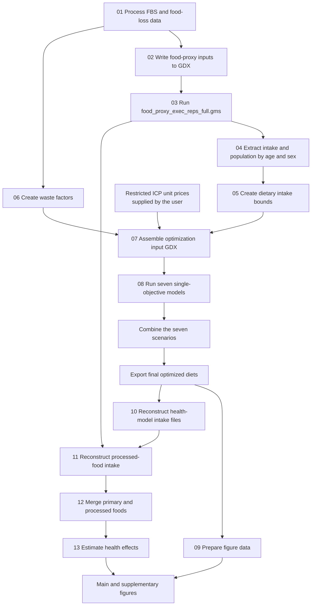

# Reproduction package for “Achieving healthy and sustainable diets across countries and demographic groups requires profound dietary change and entails unequal costs”

This repository is the reproduction package for the manuscript **“Achieving healthy and sustainable diets across countries and demographic groups requires profound dietary change and entails unequal costs.”** It contains the data-processing, optimization, health-impact, and figure-generation workflow used to construct nutritionally adequate diets by country, age group, and sex and to assess their economic, environmental, and health implications.

## Authors and affiliations

Zhongci Deng<sup>1</sup>, Zhen Wang<sup>1,2,\*</sup>, Yuanchao Hu<sup>3</sup>, Pan He<sup>4</sup>, and Brett A Bryan<sup>5</sup>

<sup>1</sup> College of Resources and Environment, Huazhong Agricultural University, Wuhan 4300770, China\
<sup>2</sup> Interdisciplinary Research Center for Territorial Spatial Governance and Green Development, Huazhong Agricultural University, Wuhan 430070, China\
<sup>3</sup> School of Resources and Environmental Sciences, Wuhan University, Wuhan 430079, China\
<sup>4</sup> School of Earth and Ocean Sciences, Cardiff University, Cardiff, UK\
<sup>5</sup> School of Life and Environmental Sciences, Deakin University, Melbourne, Vic, Australia

**Corresponding author:** Zhen Wang ([sinoo\@mail.hzau.edu.cn](mailto:sinoo@mail.hzau.edu.cn))

## Package at a glance

| Item | Description |
|----|----|
| Analysis unit | Country × 17 age groups × 2 sexes |
| Reference year | 2020 |
| Main software | R and GAMS 49 |
| Workflow | 13 ordered stages, from Food Balance Sheet processing to health-impact estimation |
| Included materials | Model-ready inputs, processing and model code, intermediate outputs, figure data, and figure scripts |
| Restricted input | Country- and food-specific ICP unit prices |
| Main outputs | Optimized diets, cost and environmental indicators, nutrient-adequacy results, health-effect estimates, and manuscript figures |

> [!IMPORTANT] **All data required by this workflow are provided except the country- and food-specific unit price data.** The original unit price data cannot be redistributed. Users must independently apply for access through the **International Comparison Program (ICP)** and prepare the price matrix in the format required by this repository.
>
> The included `output data/Price_FAO_fake.xlsx` file contains **synthetic placeholder values only**. It is supplied solely to demonstrate the required file structure and allow the code to be tested. For a functional test, copy it locally to `output data/Price_FAO.xlsx`; that working filename is ignored by Git. These simulated prices must not be used for scientific interpretation, cost comparisons, validation, publication, or exact reproduction of the study results. For scientific reproduction, create `output data/Price_FAO.xlsx` from authorized ICP price data before running Step 07 and all subsequent optimization, economic, and figure analyses.

## How to use this package

Choose the route that matches your purpose:

1.  **Inspect the included workflow and outputs.** Start with [Repository structure](#repository-structure), [Workflow overview](#workflow-overview), and [Main figures](#main-figures). The package already contains the principal intermediate and final outputs.
2.  **Run a functional test.** Follow [Software requirements](#software-requirements), update the local paths, and use the supplied synthetic price matrix. Outputs from this route are for software testing only.
3.  **Reproduce the scientific results.** Obtain authorized ICP item-price data, replace `output data/Price_FAO.xlsx`, and then follow [Reproduction instructions](#reproduction-instructions) in order.

The seven single-objective models in Step 08.1 may be run independently. All other dependencies and required hand-off files are summarized in [Required output checks](#required-output-checks).

## Contents

- [Reproduction scope and data access](#data-availability-and-reproduction-scope)
- [Data sources](#data-sources-and-access)
- [Workflow overview](#workflow-overview)
- [Main figures](#main-figures)
- [Repository structure](#repository-structure)
- [Software and path requirements](#software-requirements)
- [Data conventions](#data-conventions)
- [Reproduction instructions](#reproduction-instructions)
- [Workflow details](#workflow-details)
- [Figure-generation code](#figure-generation-code)
- [Required output checks](#required-output-checks)
- [Troubleshooting](#troubleshooting)
- [References](#references)

## Data availability and reproduction scope {#data-availability-and-reproduction-scope}

The repository provides the FBS inputs, demographic data, nutrient coefficients, food-loss and waste factors, environmental intensities, health-model inputs, model code, processing scripts, and plotting code required by the workflow. The only restricted input is the unit price of each food in each country.

| Data component | Included | Reproduction use |
|----|---:|----|
| FBS, demographic, nutrient, environmental, and health inputs | Yes | Ready for use |
| Country- and food-specific unit prices | No | Apply independently through ICP |
| Synthetic price matrix | Yes | Code testing and format demonstration only |

The placeholder price workbook has the same structure expected by the scripts but does not represent observed market prices. Because prices enter the minimum-cost model and the combined optimization workflow, using the placeholder values can affect optimized diets, estimated costs, and downstream results. Exact reproduction therefore requires authorized ICP data to be inserted before Step 07.

The replacement workbook must:

- be named `Price_FAO.xlsx` and stored in `output data`;
- contain ISO3 country codes in the first column;
- contain the model food items in the remaining columns;
- use the same country and food ordering defined by `Input data/Country.xlsx` and `Input data/Food.xlsx`;
- contain unit prices expressed in the units expected by the optimization model.

## Data sources and access {#data-sources-and-access}

The files distributed with this repository are fixed, model-ready versions of the source data. Public databases may be revised after download, so downloading the latest release will not necessarily reproduce the values in the supplied files. For exact reproduction, use the supplied inputs except for the restricted ICP price matrix, which must be obtained independently and prepared as described above.

| Source | Files or components in this package | Access and use notes |
|----|----|----|
| Global Dietary Database (GDD) | `food_proxy_code_data_reps/input_reps_full/GDD_data_2020.gdx` | Demographic dietary patterns projected to 2020. See [GDD downloads](https://www.globaldietarydatabase.org/data-download) and references 1–3. |
| Energy requirements (`IOM` in the GAMS code) | `food_proxy_code_data_reps/input_reps_full/IOM_data_2020.gdx`; `EER_GDD`, `pop_GDD`, `IOM_energy`, `IOM_pop` | Harmonized GDX supplied by Marco Springmann; it is not a direct Institute of Medicine download. See references 4–6 and the [GDD-IA archive](https://doi.org/10.5281/zenodo.20818140). |
| GDD-IA food-proxy method | `food_proxy_code_data_reps/food_proxy_exec_reps_full.gms` and supporting GAMS files | Combines waste-adjusted FAO availability, GDD demographic patterns, and anthropometry-based energy intake. See the [article](https://doi.org/10.1038/s43016-026-01388-z), [archive](https://doi.org/10.5281/zenodo.20818140), and reference 6. |
| FAO Food Balance Sheets | `Input data/FoodBalanceSheets.xlsx`, `FBS_kcal.xlsx`, `FBS_weight.xlsx`, and related GDX inputs | Uses 2020 supply in grams and kilocalories per person per day. See [FAOSTAT Food Balances](https://www.fao.org/faostat/en/#data/FBS) and references 7–8. |
| FAO Supply Utilization Accounts | `food_proxy_code_data_reps/input_reps_full/cns_SUA.xlsx` and processed-dairy allocation | Used to separate milk equivalents into dairy products. See [FAOSTAT SUA](https://www.fao.org/faostat/en/#data/SCL) and references 6 and 9. |
| Food-loss and food-waste parameters | `Input data/waste_food.xlsx`, `waste_conversion factors.xlsx`, `Share of processed food.xlsx` | Harmonized distribution- and consumption-stage loss percentages. See the [FAO report](https://www.fao.org/docrep/014/mb060e/mb060e.pdf) and reference 10. |
| Nutrient composition | Nutrient CSV files in `Input data` | Country- and food-specific model-ready derivatives of GENuS. See the [GENuS article](https://doi.org/10.1371/journal.pone.0146976) and reference 11. |
| Country- and food-specific unit prices | Authorized local `output data/Price_FAO.xlsx` | Restricted. Apply through the [ICP programme](https://www.worldbank.org/en/programs/icp/data). The distributed `Price_FAO_fake.xlsx` workbook is synthetic and is only for testing. See references 12–13. |
| Environmental impact factors | `output data/intensity data.xlsx` and figure-directory copies | Covers greenhouse-gas emissions, land, freshwater, acidification, and eutrophication. See [Poore and Nemecek](https://doi.org/10.1126/science.aaq0216) and references 6 and 14. |
| Cause-specific mortality | `Health model/IHME-GBD_2023_DATA*.csv`, `Health model/Death rate.xlsx` | Uses 2020 age- and sex-specific rates. See the [IHME GBD Results Tool](https://vizhub.healthdata.org/gbd-results/) and reference 15. |
| Dietary relative risks | `Health model/risk factor.xlsx` | Food–disease dose-response parameters and 95% confidence intervals. See the [Global Nutrition Report methods](https://globalnutritionreport.org/reports/2021-global-nutrition-report/appendix-chapter-2-methodology-and-data-sources/) and references 16–19. |
| Population and income groups | Population embedded in `IOM`/GDD inputs; `Health model/income group.xlsx` and figure copies | Retain the package versions because estimates and classifications change over time. See [UN WPP](https://population.un.org/wpp/), [World Bank groups](https://datahelpdesk.worldbank.org/knowledgebase/articles/906519-world-bank-country-and-lending-groups), and references 20–21. |
| EAT–Lancet sensitivity targets | `08_optimized model/sensitivity-EAT-Lancet.gms` and supplementary-figure copy | Used only for the optional sensitivity analysis. See the [Lancet article](https://doi.org/10.1016/S0140-6736(18)31788-4) and reference 22. |

### Source-specific reproduction notes

- `GDD_data_2020.gdx` and `IOM_data_2020.gdx` are already harmonized inputs for the Springmann food-proxy code. They should not be rebuilt from current portal downloads unless the full harmonization and 2020 projection procedure is also repeated.
- The FAOSTAT files in this repository are filtered and renamed to the project country and food domains. FAOSTAT downloads must therefore pass through Steps 01 and 02 before they can be used by the food-proxy model.
- `output data/intensity data.xlsx` is a food-group mapping of the environmental factors, not a raw export from the source publication.
- The exact ICP item-price data cannot be redistributed. Public ICP PPP tables are not a substitute for the detailed item-level national annual average prices required by this model.
- Record the download date, database release, any access request identifier, currency conversion, price year, and every mapping decision when replacing or updating an external dataset.

## Workflow overview {#workflow-overview}

The current repository contains 13 logical steps. Steps 03 and 08 are manual GAMS stages, while the other main steps are R scripts. For this reason, there is no `03_*.R` file or standalone `08_*.R` file in the project root. The health model is the final step and is implemented in `13_health_model.R`.



The required execution order is:

``` text
01 -> 02 -> 03 (GAMS) -> 04 -> 05 -> 06 -> 07
   -> 08 (seven min*.gms models -> combineScenarios_nutrient.gms -> final output.gms)
   -> 09 -> 10 -> 11 -> 12 -> 13
```

Step 06 depends on the FBS output from Step 01 but does not depend on Steps 03–05. It may therefore be prepared separately, provided it is completed before Step 07.

## Main figures {#main-figures}

The current Figure 1–5 exports are displayed below. Their source data and plotting scripts are stored under `output data/fig`.

### Figure 1. Current and optimized dietary intake patterns


### Figure 2. Economic implications of optimized diets


### Figure 3. Environmental implications of optimized diets


### Figure 4. Nutrient and food drivers of nutritional adequacy gains


### Figure 5. Estimated health effects of optimized diets


## Repository structure {#repository-structure}

``` text
Code/
├── 01_FBS inputs data.R
├── 02_Write GAMS data.R
├── 04_read_fbs_proxy_gdx.R
├── 05_upper and lower bound.R
├── 06_create waste factor.R
├── 07_data for optimization.R
├── 08_optimized model/
│   ├── minCost.gms
│   ├── minStructure.gms
│   ├── minLand.gms
│   ├── minGHG.gms
│   ├── minWater.gms
│   ├── minNitrogen.gms
│   ├── minPhosphorus.gms
│   ├── combineScenarios_nutrient.gms
│   ├── final output.gms
│   └── Input/Parameter/Variables/Equations/Constraints_*.gms
├── 09_optimized data processing.R
├── 10_reconstruction.R
├── 11_reconstruct_prcd_from_prim_xlsx.R
├── 12_merge_prim_prcd_age_workbooks.R
├── 13_health_model.R
├── Input data/                       # Primary inputs and nutrient coefficients
├── food_proxy_code_data_reps/
│   ├── food_proxy_exec_reps_full.gms
│   ├── code_reps_full/               # Food-proxy model code
│   ├── input_reps_full/              # Food-proxy model inputs
│   └── output_reps_full/             # Food-proxy model outputs
├── output data/
│   ├── optimized model output/       # Optimization GDX and Excel outputs
│   └── fig/                          # Figure data, scripts, and exports
└── Health model/                     # Health-model inputs and outputs
```

## Software requirements {#software-requirements}

### R

The main workflow uses the following R packages:

``` r
install.packages(c(
  "dplyr", "tidyr", "readxl", "readr", "stringr", "purrr",
  "openxlsx", "writexl"
))
```

The `gdxrrw` package is supplied with GAMS and must be installed according to the instructions in the local GAMS installation. The scripts connect it to GAMS through `igdx()`.

The figure scripts additionally use:

``` r
install.packages(c(
  "ggplot2", "scales", "cowplot", "patchwork", "sf",
  "svglite", "ragg", "jsonlite"
))
```

The `grid` package is distributed with R and does not need to be installed separately. Map scripts require `sf` and its system dependencies.

### GAMS

The GAMS system directory currently configured in the R scripts is:

``` text
/Library/Frameworks/GAMS.framework/Versions/49/Resources/
```

The current setup therefore uses GAMS 49. `gdxrrw` must be able to access this directory. The optimization stage uses SoPlex for the linear models and CONOPT4 for the quadratic dietary-structure model. GAMS must also support the Connect/ExcelWriter functionality used by `final output.gms`.

### Project path

The project is currently configured at:

``` text
/Users/zhongcideng/Desktop/dengzc/2026/paper/national age specific/Code
```

If the project is moved, update the following locations before running the workflow:

- `project_dir` near the top of each main R script;
- the two explicit `FBS_kcal.xlsx` and `FBS_weight.xlsx` output paths in `01_FBS inputs data.R`;
- the input and output paths in `09_optimized data processing.R`;
- `RAW_GDX` in `08_optimized model/Input.gms`;
- `ROOT` and `OUT_GDX` in each `08_optimized model/min*.gms` file;
- `ROOT`, `OUTDIR`, `OUT_GDX`, and the raw-data GDX paths in `combineScenarios_nutrient.gms`;
- all global file paths at the beginning of `final output.gms`;
- absolute paths in individual figure scripts, especially `fig1/Fig1.R` and `fig3/Fig3.R`.

## Data conventions {#data-conventions}

### Country and food filters

- The first column of `Input data/Country.xlsx` defines the countries to retain and their ISO3 order.
- The first column of `Input data/Food.xlsx` defines the foods to retain and their order.
- `Input data/FoodItem to Food.xlsx` maps full food-item names to the abbreviated names used by the model.
- Steps 04, 05, and 06 apply these lists so the country and food domains remain consistent in downstream files.

### Age groups

The fixed age order is:

``` text
0-4, 5-9, 10-14, 15-19, 20-24, 25-29, 30-34, 35-39,
40-44, 45-49, 50-54, 55-59, 60-64, 65-69, 70-74, 75-79, 80+
```

### Sex codes

- `FML`: female;
- `MLE`: male;
- `BTH`: both sexes. This category is present in some food-proxy outputs but is excluded in Step 04.

### Scenario labels

- `Ori` or `Current diets`: original diets;
- `New`, `Opt`, or `Optimized diets`: optimized diets.

## Reproduction instructions {#reproduction-instructions}

All commands below start from the project root. File names containing spaces must be quoted.

> [!CAUTION] For scientific reproduction, stop after Step 06 unless `output data/Price_FAO.xlsx` has been created from authorized ICP unit price data. The repository's `Price_FAO_fake.xlsx` workbook may be copied to that working filename only to test whether later stages execute; the resulting diets, costs, impacts, and figures are not scientific results.

``` bash
cd "/Users/zhongcideng/Desktop/dengzc/2026/paper/national age specific/Code"

Rscript "01_FBS inputs data.R"
Rscript "02_Write GAMS data.R"

cd "food_proxy_code_data_reps"
gams food_proxy_exec_reps_full.gms
cd ..

Rscript "04_read_fbs_proxy_gdx.R"
Rscript "05_upper and lower bound.R"
Rscript "06_create waste factor.R"
Rscript "07_data for optimization.R"

gams "08_optimized model/minCost.gms"
gams "08_optimized model/minStructure.gms"
gams "08_optimized model/minLand.gms"
gams "08_optimized model/minGHG.gms"
gams "08_optimized model/minWater.gms"
gams "08_optimized model/minNitrogen.gms"
gams "08_optimized model/minPhosphorus.gms"
gams "08_optimized model/combineScenarios_nutrient.gms"
gams "08_optimized model/final output.gms"

Rscript "09_optimized data processing.R"
Rscript "10_reconstruction.R"
Rscript "11_reconstruct_prcd_from_prim_xlsx.R"
Rscript "12_merge_prim_prcd_age_workbooks.R"
Rscript "13_health_model.R"
```

The seven `min*.gms` files are independent of one another. However, `combineScenarios_nutrient.gms` must be run only after all seven result GDX files have been created, and `final output.gms` must be run after the scenario-combination model finishes.

## Workflow details {#workflow-details}

### Step 01 — Prepare the FBS inputs

Script: `01_FBS inputs data.R`

Purpose: convert FAO Food Balance Sheet data into the long-format input required by the food-proxy model and create the energy and mass supply tables used later to calculate waste factors.

Inputs:

- `Input data/FoodBalanceSheets.xlsx`, sheet `FBS_ISO_filtered`;
- `Input data/Fooditem.xlsx`;
- `Input data/waste_conversion factors.xlsx`;
- `Input data/waste_food.xlsx`;
- `Input data/Share of processed food.xlsx`.

Processing:

1.  Reshape annual FBS columns into country-food-year records.
2.  Retain food energy supply in `kcal/d`.
3.  Convert food supply quantity from `kg/capita/year` to `g/d`.
4.  Calculate waste-adjusted `kcal/d_w` and `g/d_w` values from the fresh/processed shares, conversion factors, distribution waste, and consumption waste.
5.  Preserve the original wide `FBS_input` object unchanged. The final long table retains only country-food combinations for which all four measures are available.
6.  Add `all-fg` and `total` summaries for the energy measures.

Outputs:

- `Input data/FBS_kcal.xlsx`;
- `Input data/FBS_weight.xlsx`;
- `food_proxy_code_data_reps/input_reps_full/FBS_intake_data.xlsx`.

The final food-proxy input contains the columns `rgs`, `fooditem`, `unit`, `year`, and `value`.

### Step 02 — Write food-proxy inputs to GDX

Script: `02_Write GAMS data.R`

Purpose: convert the Excel inputs in `food_proxy_code_data_reps/input_reps_full` into the sparse sets and parameters required by GAMS.

Processing:

- Read all `.xlsx` files in the input folder.
- Sanitize GAMS symbol and dimension names.
- Write `fg_SUA` as a set.
- Write the remaining tables as sparse GAMS parameters.
- Combine the converted objects into one GDX file through `gdxrrw`.

Output:

- `food_proxy_code_data_reps/input_reps_full/all_raw_data.gdx`.

### Step 03 — Run the food-proxy model

Main program: `food_proxy_code_data_reps/food_proxy_exec_reps_full.gms`

This program must be launched from the `food_proxy_code_data_reps` directory because it uses the following relative directories:

``` text
code_reps_full
input_reps_full
output_reps_full
```

The program loads:

- `code_reps_full/prxy_sets_full.gms` for model sets;
- `code_reps_full/prxy_data_full.gms` for input data;
- `code_reps_full/prxy_cons_full.gms` for the proxy calculations and exports.

The current control settings run the model for 2020, include all countries, and allow eight threads. This stage converts national food availability into dietary intake estimates for different demographic groups.

Main outputs:

- `food_proxy_code_data_reps/output_reps_full/FBS_proxy_2020.gdx`;
- `intake_grams_2020.csv`;
- `intake_kcals_2020.csv`;
- `pop_2020.csv`;
- `demand_2020.csv`.

The main downstream input is `FBS_proxy_2020.gdx`.

### Step 04 — Extract intake and population by age and sex

Script: `04_read_fbs_proxy_gdx.R`

Purpose: extract population and mean dietary intake from the food-proxy GDX and reshape them into the Excel format used by the optimization workflow.

GDX parameters read by the script:

- `pop(region, age, sex, residence, year)`;
- `FBS_intake_age_sex_agg(type, unit, food_group, region, age, sex, year, stats)`.

Filters:

- Retain only countries listed in `Input data/Country.xlsx`.
- Retain only foods listed in `Input data/Food.xlsx`.
- Exclude `BTH` and `all-a` records.
- Retain `stats = mean` and `unit = g/d_w` for dietary intake.
- Retain `residence = all-u` for population.
- Multiply population values by 1,000 and round to integers.

Outputs:

- `output data/population.xlsx`;
- `output data/FML_age_groups.xlsx`;
- `output data/MLE_age_groups.xlsx`.

Each FML/MLE workbook contains one sheet per age group. Rows are countries, columns are foods, and missing country-food combinations are filled with zero. Sheets and age records follow the fixed order from `0-4` to `80+`.

### Step 05 — Create dietary intake bounds

Script: `05_upper and lower bound.R`

Purpose: define the country-, age-, sex-, and food-specific lower and upper intake bounds used by the optimization model.

Rules:

- The lower bound is 10% of current intake.
- The general upper bound is the larger of current intake and the cross-country 95th percentile for the same age-food combination.
- The pork upper bound is fixed at current intake in the specified pork-restricted countries.
- The beef and lamb upper bounds are fixed at current intake in India and Nepal.

Outputs:

- `output data/food_intake_lower_by_age_FML.xlsx`;
- `output data/food_intake_lower_by_age_MLE.xlsx`;
- `output data/food_intake_upper_by_age_FML.xlsx`;
- `output data/food_intake_upper_by_age_MLE.xlsx`.

### Step 06 — Create waste factors

Script: `06_create waste factor.R`

Purpose: calculate the country-food coefficients used to convert food supply into edible intake.

Processing:

1.  Map full `FoodItem` names to model abbreviations using `Input data/FoodItem to Food.xlsx`.
2.  Filter and order countries and foods using `Country.xlsx` and `Food.xlsx`.
3.  Calculate the usable fraction separately for fresh and processed food.
4.  Sum the fresh and processed fractions for each country-food combination.

The coefficient is calculated as:

``` text
Share / 100 x CF x (1 - distribution_waste / 100)
               x (1 - consumption_waste / 100)
```

Output:

- `output data/waste_factor.xlsx`, with ISO3 codes in rows and foods in columns.

### Step 07 — Assemble the optimization input GDX

Script: `07_data for optimization.R`

Purpose: combine nutrient composition, current intake, intake bounds, prices, environmental intensities, waste factors, and population into one GDX input for the optimization models.

Before running this step, create `output data/Price_FAO.xlsx` from the authorized ICP unit price data. For a functional test only, copy `output data/Price_FAO_fake.xlsx` to that working filename. Continuing with the placeholder values is suitable only for testing whether the workflow executes.

Inputs:

- All nutrient CSV files in `Input data`, including energy, protein, minerals, and vitamins;
- FML/MLE intake and population outputs from Step 04;
- FML/MLE lower and upper intake workbooks from Step 05;
- `output data/waste_factor.xlsx` from Step 06;
- `output data/Price_FAO.xlsx` — authorized ICP prices supplied locally by the user, or a local copy of `Price_FAO_fake.xlsx` for functional testing only;
- `output data/intensity data.xlsx`.

Main sets:

- `i`: countries;
- `j`: foods;
- `emi`: environmental indicators;
- `age`: 17 age groups;
- `sex`: FML and MLE.

Main parameters:

- country-food nutrient coefficients;
- `waste(i,j)`;
- `Price(i,j)`;
- `Demand_ori(i,j,age,sex)`;
- `DemandLB(i,j,age,sex)`;
- `DemandUB(i,j,age,sex)`;
- `Intensity(emi,j)`;
- `pop(i,age,sex)`.

Output:

- `output data/all_raw_data_newIntensity.gdx`.

### Step 08 — Optimize diets

Directory: `08_optimized model`

#### Step 08.1 — Run the seven single-objective scenarios

Run the following seven models first:

| Model | Objective | Output |
|----|----|----|
| `minCost.gms` | Food cost | `base_Costmin_new.gdx` |
| `minStructure.gms` | Deviation from current dietary structure | `base_Structuremin_new.gdx` |
| `minLand.gms` | Land use | `base_Landmin_new.gdx` |
| `minGHG.gms` | Greenhouse-gas emissions | `base_GHGmin_new.gdx` |
| `minWater.gms` | Freshwater use | `base_Watermin_new.gdx` |
| `minNitrogen.gms` | Acidification impact | `base_Acidmin_new.gdx` |
| `minPhosphorus.gms` | Eutrophication impact | `base_Eutrmin_new.gdx` |

All outputs are written to `output data/optimized model output`.

The seven models share the following components:

- `Input.gms`: reads the Step 07 GDX;
- `Parameter_indexed.gms`: declares model parameters and nutrient/food-group definitions;
- `Variables_indexed.gms`: declares decision variables;
- `Equations_indexed.gms`: defines objectives and accounting equations;
- `Constraints_indexed.gms`: defines nutrient, food-intake, and other constraints.

Models are solved separately by country. Each program requires `modelstat = Optimal` and `solvestat = NormalCompletion`. A failed country solve stops the model so incomplete results are not passed downstream.

#### Step 08.2 — Combine the seven scenarios

Program: `combineScenarios_nutrient.gms`

Purpose: load the seven single-objective solutions, assign each scenario a weight of `1/7`, and construct a common optimized diet that continues to satisfy nutrient, food-group, and intake-bound constraints.

Output:

- `output data/optimized model output/00base_weighted_new111_17groups_sugar014.gdx`.

#### Step 08.3 — Export final optimized diets

Program: `final output.gms`

Purpose: combine the weighted-scenario solution with the original input data and export the workbooks required for downstream analysis.

Outputs:

- `output data/optimized model output/00Coefficient.xlsx`;
- `output data/optimized model output/00Intake_FML.xlsx`;
- `output data/optimized model output/00Intake_MLE.xlsx`;
- `output data/optimized model output/00other result.xlsx`;
- `output data/optimized model output/00outputall_temp.gdx`.

Each FML/MLE intake workbook contains 17 `New_age` sheets and 17 `Ori_age` sheets.

`08_optimized model/sensitivity-EAT-Lancet.gms` is an optional EAT-Lancet sensitivity analysis and is not part of the primary optimization sequence.

### Step 09 — Process optimization outputs and prepare figure data

Script: `09_optimized data processing.R`

Purpose: aggregate optimized model results into food-group, price, environmental, and nutrient outputs and prepare source tables for the main and supplementary figures.

Inputs:

- `00Coefficient.xlsx`;
- `00Intake_FML.xlsx`;
- `00Intake_MLE.xlsx`;
- `Input data/ISO groups.xlsx`.

The food items are aggregated into eight groups: Seafood, Dairy & eggs, Meat, Sugar & oil, Staple foods, Legumes & nuts, Fruits, and Vegetable.

Main outputs:

- `output data/fig/fig1/00fig1.xlsx`: energy and food-group intake;
- `output data/fig/fig2/00fig2.xlsx`: dietary cost;
- `output data/fig/fig2/Price_New.xlsx` and `Price_Ori.xlsx`;
- `output data/fig/fig3/00fig3.xlsx`: environmental impacts;
- `output data/fig/fig3/Envir_New.xlsx` and `Envir_Ori.xlsx`;
- `output data/fig/fig4/00fig4.xlsx`: nutrient results;
- `output data/fig/fig4/00Nutrient_New.xlsx` and `00Nutrient_Ori.xlsx`;
- `output data/fig/figs/figs1/Intake_groups_all_demographic.xlsx`: intake structure for all demographic groups.

This step creates figure-ready data but does not render the final manuscript figures.

### Step 10 — Reconstruct health-model intake workbooks

Script: `10_reconstruction.R`

Purpose: split the New and Ori sheets from `00Intake_FML.xlsx` and `00Intake_MLE.xlsx` into four health-model input workbooks.

Outputs in `Health model`:

- `00New_FML_age_groups.xlsx`;
- `00New_MLE_age_groups.xlsx`;
- `00Ori_FML_age_groups.xlsx`;
- `00Ori_MLE_age_groups.xlsx`.

Each workbook contains 17 age sheets with the columns `type`, `unit`, `food_group`, `region`, `age`, `sex`, `year`, `stats`, and `value`. The final worksheet is named `80plus`, while its age value remains `80+`. Missing intake values are filled with zero.

### Step 11 — Reconstruct processed-food intake

Script: `11_reconstruct_prcd_from_prim_xlsx.R`

Purpose: use reference shares from `FBS_proxy_2020.gdx` to reconstruct processed-food categories from the primary-food intake files created in Step 10.

All four primary workbooks are processed in one run. The reconstructed categories include:

- grains: `whole_grains` and `prc_grains`;
- red meat: `red_meat` and `prc_meat`;
- milk: `yoghurt`, `cheese`, and `milk_actl`.

Outputs in `Health model` use the original file name plus the `_prcd` suffix:

- `00New_FML_age_groups_prcd.xlsx`;
- `00New_MLE_age_groups_prcd.xlsx`;
- `00Ori_FML_age_groups_prcd.xlsx`;
- `00Ori_MLE_age_groups_prcd.xlsx`.

### Step 12 — Merge primary and processed-food intake

Script: `12_merge_prim_prcd_age_workbooks.R`

Purpose: merge female and male records and combine primary and processed-food intake into the original and optimized workbooks used directly by the health model.

Outputs in `Health model`:

- `00Intake_Ori.xlsx`;
- `00Intake_Opt.xlsx`;
- `merge_age_groups_check.csv`.

`merge_age_groups_check.csv` records row counts by age, scenario, sex, and source so the completeness of the merged data can be checked.

### Step 13 — Estimate health effects

Script: `13_health_model.R`

Purpose: calculate intake changes between original and optimized diets, the corresponding Potential Impact Fractions (PIFs), and changes in deaths.

Inputs in `Health model`:

- `00Intake_Ori.xlsx`;
- `00Intake_Opt.xlsx`;
- `food factor.xlsx`;
- `risk factor.xlsx`;
- `Death rate.xlsx`;
- `population.xlsx`.

Health effects are calculated for age groups from 20–24 through 80+. The modeled health-related food categories are Processed meat, Red meat, Fruits, Vegetables, Whole grains, Legumes, and Nuts. In the current implementation, `prc_grains` is excluded from Whole grains in the original diet but included as Whole grains in the optimized diet.

The model has three stages:

1.  **Intake aggregation:** map model foods to health-risk food categories and calculate original and optimized intake.
2.  **PIF calculation:** calculate PIFs from relative risks, serving sizes, and intake changes.
3.  **Death calculation:** combine PIFs with age-sex-specific death rates and population.

The change in deaths is calculated as:

``` text
delta_deaths = PIF x death_rate_per_100k x population / 100000
```

Outputs in `Health model`:

- `health_food_intake_step1.xlsx`;
- `health_food_pif_step2.xlsx`;
- `health_food_deaths_step3.xlsx`.

## Figure-generation code {#figure-generation-code}

The plotting workflows under `output data/fig` are downstream analyses. They do not alter the main optimization or health-model results. Run each plotting script from its own directory unless it explicitly resolves paths from the script location.

### Main figures

| Directory | Script | Purpose | Main output |
|----|----|----|----|
| `fig1` | `Fig1.R` | Compare current and optimized energy intake and eight food groups across ages, sexes, and income groups | `Fig1new.svg` |
| `fig2` | `Fig2.R` | Show economic implications by country, income group, and demographic contribution | `Fig2new.svg` |
| `fig3` | `Fig3.R` | Original environmental-impact figure workflow | `00Fig3.svg` |
| `fig3` | `Fig3new.R` | Reuse the original calculations and generate the revised country and demographic environmental figure | `Fig3new.svg`, `Fig3new.png` |
| `fig4` | `calculate_country_first_adequacy.R` | Calculate nutrient adequacy and food contributions at the country level before aggregation | `country_first_nutrient_adequacy.csv`, `country_first_food_contributions.csv` |
| `fig4` | `calculate_country_level_dominant_nutrient.R` | Identify the dominant nutrient for each country-age-sex unit | `country_level_dominant_nutrient.csv`, `country_level_dominant_summary.csv` |
| `fig4` | `Figure4_bc_submission.R` | Plot the dominant nutrients and food sources underlying nutritional-adequacy gains | SVG, PDF, TIFF, PNG, source-data CSVs, and QA files in `Figure4_bc_submission_output` |
| `fig5` | `Fig5.R` | Plot estimated death changes by country, income group, endpoint, age, and sex | `Fig5.svg`, `Fig5.png` |

Important figure inputs:

- `Fig1.R` currently reads `fig1.xlsx`, whereas Step 09 writes `00fig1.xlsx`. Confirm that `fig1.xlsx` is the intended plotting version before running the script.
- `Fig2.R` reads `00fig2.xlsx`, `population_long.xlsx`, `ISO groups.xlsx`, and `world.geojson`.
- `Fig3new.R` reads `00fig3a.xlsx` and sources `Fig3.R`. The current `Fig3.R` still contains an older absolute `data_dir` and must be updated if the directory changes.
- Figure 4 uses `00Nutrient_Ori.xlsx`, `00Nutrient_New.xlsx`, `RDA.xlsx`, `population_long.xlsx`, and `Income-level.xlsx`.
- `Fig5.R` reads `health_food_deaths_step3.xlsx`, `income group.xlsx`, and `world.geojson`. After rerunning the health model, ensure that the copy in the figure directory matches the latest file in `Health model`.

### Supplementary figures

| Directory | Script | Purpose | Main output |
|----|----|----|----|
| `figs/figs1` | `plot_structure_deviation_maps.R` | Map mean dietary-structure deviation between optimized and current diets by age and sex | `structure_deviation_maps/structure_deviation_all.svg` and PNG |
| `figs/figs3-4` | `sensitivity-EAT-Lancet.gms` | Generate the EAT-Lancet sensitivity demand scenario | `sensitivity-EAT-Lancet-demand.xlsx` |
| `figs/figs3-4` | `plot_FigS3_energy_structure.R` | Plot national and income-group energy and food-structure changes under the EAT-Lancet scenario | `FigS3_energy_structure.svg` |
| `figs/figs3-4` | `calculate_EAT_food_cost.R` | Calculate EAT-Lancet food costs using prices, waste coefficients, and population | `sensitivity-EAT-Lancet-food-cost.xlsx` |
| `figs/figs3-4` | `plot_FigS4_food_cost.R` | Plot national and income-group food-cost changes under the EAT-Lancet scenario | `FigS4_food_cost.svg` |
| `figs/figs5` | `calculate_environmental_impacts.R` | Calculate five environmental impacts for the EAT-Lancet scenario | `sensitivity-EAT-Lancet-environmental-impact.xlsx` |
| `figs/figs5` | `plot_FigS5_environmental_impact_maps.R` | Map country-level changes in the five environmental indicators | SVG, PDF, TIFF, PNG, source data, and QA files in `FigS5_environmental_impact_maps_output` |
| `figs/figs6` | `plot_FigS6_stacked_impacts.R` | Compare current and optimized environmental impacts by food group at global, income, sex, and age levels | `FigS6_output` |
| `figs/figs7` | `plot_FigS7_income_age_stacked_impacts.R` | Show environmental-impact composition by income group, age, and scenario | `FigS7_output` |
| `figs/figs9` | `plot_FigS9_country_disease_maps.R` | Map country-level death changes for five disease endpoints | `FigS9_country_disease_maps_output/FigS9_country_disease_maps.svg` |

The `figs/figs2` and `figs/figs8` directories currently contain no executable R or GAMS plotting scripts; they contain existing figure or editing files only.

## Required output checks {#required-output-checks}

Before starting the next stage, confirm that the following files exist:

| Completed stage | Required file or files | Required by |
|----|----|----|
| 01 | `food_proxy_code_data_reps/input_reps_full/FBS_intake_data.xlsx` | 02 |
| 02 | `food_proxy_code_data_reps/input_reps_full/all_raw_data.gdx` | 03 |
| 03 | `food_proxy_code_data_reps/output_reps_full/FBS_proxy_2020.gdx` | 04 and 11 |
| 04 | `FML_age_groups.xlsx`, `MLE_age_groups.xlsx`, `population.xlsx` | 05 and 07 |
| 05 | Four FML/MLE lower- and upper-bound workbooks | 07 |
| 06 | `waste_factor.xlsx` | 07 |
| 07 | `all_raw_data_newIntensity.gdx` | 08 |
| 08.1 | Seven `base_*min_new.gdx` files | 08.2 |
| 08.2 | `00base_weighted_new111_17groups_sugar014.gdx` | 08.3 |
| 08.3 | `00Intake_FML.xlsx`, `00Intake_MLE.xlsx`, `00Coefficient.xlsx` | 09 and 10 |
| 10 | Four New/Ori FML/MLE workbooks | 11 |
| 11 | Four `_prcd.xlsx` workbooks | 12 |
| 12 | `00Intake_Ori.xlsx`, `00Intake_Opt.xlsx` | 13 |
| 13 | `health_food_deaths_step3.xlsx` | Health-result figures |

## Troubleshooting {#troubleshooting}

### GAMS cannot find food-proxy inputs

- Run Step 03 from the `food_proxy_code_data_reps` directory.
- Confirm that Step 02 created `input_reps_full/all_raw_data.gdx`.
- Confirm that the absolute GDX paths in `08_optimized model` match the current project directory.

### R cannot read a GDX file

- Confirm that the GAMS directory is `/Library/Frameworks/GAMS.framework/Versions/49/Resources/` or update `gams_sysdir`/`gams_dir` accordingly.
- Confirm that `gdxrrw` is installed and that `igdx()` points to a valid GAMS system directory.
- `FBS_proxy_2020.gdx` is large and requires sufficient memory to read.

### Country, food, or age order is inconsistent

- Country inclusion and order are defined by `Input data/Country.xlsx`.
- Food inclusion and order are defined by `Input data/Food.xlsx`.
- Age sheets must follow the order from `0-4` through `80+`.
- The final health-intake worksheet is named `80plus`, while its internal age value and the population file use `80+`.

### A figure script cannot find its inputs

- Prefer running the script from its own figure directory.
- Check the exact input file name declared in the script; a similarly named file may not be interchangeable.
- Map scripts require the appropriate `world.geojson` file.
- `09_optimized data processing.R` and a small number of plotting scripts still contain absolute or legacy paths that must be updated if the project is moved.

### `patchwork` reports an error for `& theme()`

An error such as `Can't find method for generic &(e1, e2)` normally indicates incompatible versions of `patchwork`, `ggplot2`, or one of their dependencies. Reinstall the packages and restart the R session before rerunning the figure script. This issue affects figure assembly only and does not affect the data-processing, optimization, or health-model results.

## References {#references}

1.  Global Dietary Database. *GDD 2018 estimates and data files*. Tufts University. <https://www.globaldietarydatabase.org/data-download> (accessed 5 August 2026).

2.  Miller, V. et al. Global Dietary Database 2017: data availability and gaps on 54 major foods, beverages and nutrients among 5.6 million children and adults from 1,220 surveys worldwide. *BMJ Global Health* **6**, e003585 (2021). <https://doi.org/10.1136/bmjgh-2020-003585>.

3.  Miller, V. et al. Global dietary quality in 185 countries from 1990 to 2018 shows wide differences by nation, age, education and urbanicity. *Nature Food* **3**, 694–702 (2022). <https://doi.org/10.1038/s43016-022-00594-9>.

4.  Springmann, M. Estimates of energy intake, requirements and imbalances based on anthropometric measurements at global, regional and national levels and for sociodemographic groups: a modelling study. *BMJ Public Health* **3**, e002244 (2025). <https://doi.org/10.1136/bmjph-2024-002244>.

5.  Institute of Medicine. *Dietary Reference Intakes for Energy, Carbohydrate, Fiber, Fat, Fatty Acids, Cholesterol, Protein, and Amino Acids*. National Academies Press, Washington, DC (2005). <https://doi.org/10.17226/10490>.

6.  Springmann, M. Global dietary estimates for conducting health, environmental and economic impact assessments. *Nature Food* **7**, 722–732 (2026). <https://doi.org/10.1038/s43016-026-01388-z>. Data and code: <https://doi.org/10.5281/zenodo.20818140>.

7.  Food and Agriculture Organization of the United Nations. *FAOSTAT: Food Balances (2010–)*. FAO, Rome. <https://www.fao.org/faostat/en/#data/FBS> (accessed 5 August 2026).

8.  Food and Agriculture Organization of the United Nations. *Food Balance Sheets: A Handbook*. FAO, Rome (2001). <https://www.fao.org/4/x9892e/x9892e00.htm>.

9.  Food and Agriculture Organization of the United Nations. *FAOSTAT: Supply Utilization Accounts (2010–)*. FAO, Rome. <https://www.fao.org/faostat/en/#data/SCL> (accessed 5 August 2026).

10. Gustavsson, J., Cederberg, C., Sonesson, U., van Otterdijk, R. & Meybeck, A. *Global Food Losses and Food Waste: Extent, Causes and Prevention*. FAO, Rome (2011). <https://www.fao.org/docrep/014/mb060e/mb060e.pdf>.

11. Smith, M. R., Micha, R., Golden, C. D., Mozaffarian, D. & Myers, S. S. Global Expanded Nutrient Supply (GENuS) Model: a new method for estimating the global dietary supply of nutrients. *PLOS ONE* **11**, e0146976 (2016). <https://doi.org/10.1371/journal.pone.0146976>.

12. World Bank. *Purchasing Power Parities and the Size of World Economies: Results from the 2017 International Comparison Program*. World Bank, Washington, DC (2020). <https://doi.org/10.1596/978-1-4648-1530-0>.

13. Springmann, M., Clark, M. A., Rayner, M., Scarborough, P. & Webb, P. The global and regional costs of healthy and sustainable dietary patterns: a modelling study. *The Lancet Planetary Health* **5**, e797–e807 (2021). [https://doi.org/10.1016/S2542-5196(21)00251-5](https://doi.org/10.1016/S2542-5196(21)00251-5).

14. Poore, J. & Nemecek, T. Reducing food's environmental impacts through producers and consumers. *Science* **360**, 987–992 (2018). <https://doi.org/10.1126/science.aaq0216>.

15. Global Burden of Disease Collaborative Network. *Global Burden of Disease Study 2023 (GBD 2023) Results*. Institute for Health Metrics and Evaluation, Seattle. <https://vizhub.healthdata.org/gbd-results/>. Use the release-specific citation displayed by the Results Tool for any redistributed table or publication.

16. Springmann, M., Mozaffarian, D., Rosenzweig, C. & Micha, R. The health and environmental impacts of diets worldwide. In *2021 Global Nutrition Report: The State of Global Nutrition*, 34–50. Development Initiatives (2021). Methods and relative-risk table: <https://globalnutritionreport.org/reports/2021-global-nutrition-report/appendix-chapter-2-methodology-and-data-sources/>.

17. Bechthold, A. et al. Food groups and risk of coronary heart disease, stroke and heart failure: a systematic review and dose-response meta-analysis of prospective studies. *Critical Reviews in Food Science and Nutrition* **59**, 1071–1090 (2019). <https://doi.org/10.1080/10408398.2017.1392288>.

18. Schwingshackl, L. et al. Food groups and risk of type 2 diabetes mellitus: a systematic review and meta-analysis of prospective studies. *European Journal of Epidemiology* **32**, 363–375 (2017). <https://doi.org/10.1007/s10654-017-0246-y>.

19. Schwingshackl, L. et al. Food groups and risk of colorectal cancer. *International Journal of Cancer* **142**, 1748–1758 (2018). <https://doi.org/10.1002/ijc.31198>.

20. United Nations, Department of Economic and Social Affairs, Population Division. *World Population Prospects 2024*. United Nations, New York (2024). <https://population.un.org/wpp/>.

21. World Bank. *World Bank Country and Lending Groups*. <https://datahelpdesk.worldbank.org/knowledgebase/articles/906519-world-bank-country-and-lending-groups> (accessed 5 August 2026).

22. Willett, W. et al. Food in the Anthropocene: the EAT–Lancet Commission on healthy diets from sustainable food systems. *The Lancet* **393**, 447–492 (2019). [https://doi.org/10.1016/S0140-6736(18)31788-4](https://doi.org/10.1016/S0140-6736(18)31788-4).
